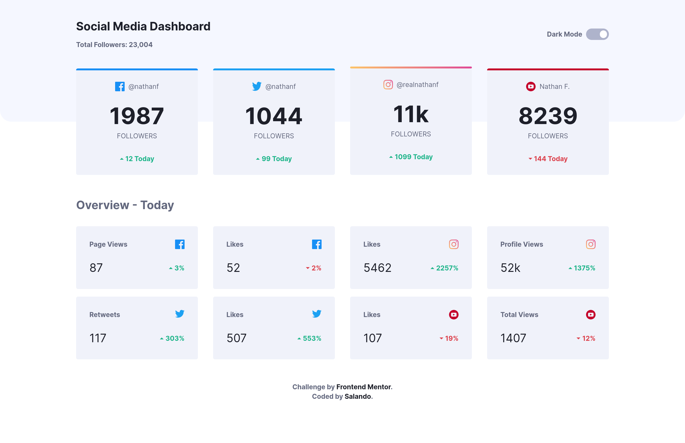

# Solución al desafío "Social Media Dashboard With Theme Switcher"

## Introducción

Esta es la [solución](https://saulorlando.github.io/social-media-dashboard-with-theme-switcher/) al desafío de Frontend Mentor "Social Media Dashboard With Theme Switcher".

## Resumen

### El Desafío

Los usuarios deberían poder:

- Ver el diseño óptimo para el sitio según el tamaño de pantalla de su dispositivo
- Ver los estados de *hover* para los elemenntos interactivos
- Alternar el tema de color según sus preferencias

## Mi Proceso

### Tecnologías

- Tailwindcss
- Postcss
- CSS
  - Flexbox
  - Grid
- HTML5

### Repansando lo aprendido

Aprendí a usar a alternar el modo oscuro con **TailwindCSS**.
Aparte de practicar el *responsive*.

### Screenshots

Me quedo de la siguinte manera:

#### Mobile

375px

Modo claro


Modo oscuro


#### Tablet

640px

Modo claro


Modo oscuro


#### Desktop

1440px

Modo claro



Modo oscuro


## Indice

- [Solución al desafío "Social Media Dashboard With Theme Switcher"](#solución-al-desafío-social-media-dashboard-with-theme-switcher)
  - [Introducción](#introducción)
  - [Resumen](#resumen)
    - [El Desafío](#el-desafío)
  - [Mi Proceso](#mi-proceso)
    - [Tecnologías](#tecnologías)
    - [Repansando lo aprendido](#repansando-lo-aprendido)
    - [Screenshots](#screenshots)
      - [Mobile](#mobile)
      - [Tablet](#tablet)
      - [Desktop](#desktop)
  - [Indice](#indice)
  - [Instalación](#instalación)
  - [Autor](#autor)

## Instalación

Para empezar a correr la página web solo hay que clonar el repositorio y correr un servdor local.

```text
git clone https://github.com/SaulOrlando/social-media-dashboard-with-theme-switcher.git
```

Si se quiere empezar a modificar hay que instalar las dependencias.

En mi caso uso **pnpm**

```text
pnpm i
```

Luego, hay que correr **TailwindCSS**.

```text
pnpm dev
```

## Autor

- [Github](https://github.com/SaulOrlando)
- [Frontend Mentor](https://www.frontendmentor.io/profile/SaulOrlando)
